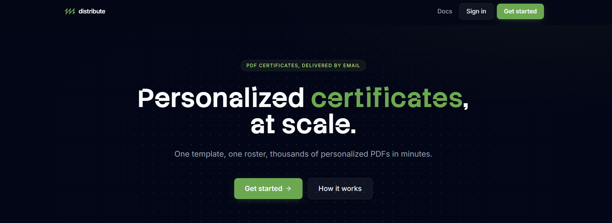
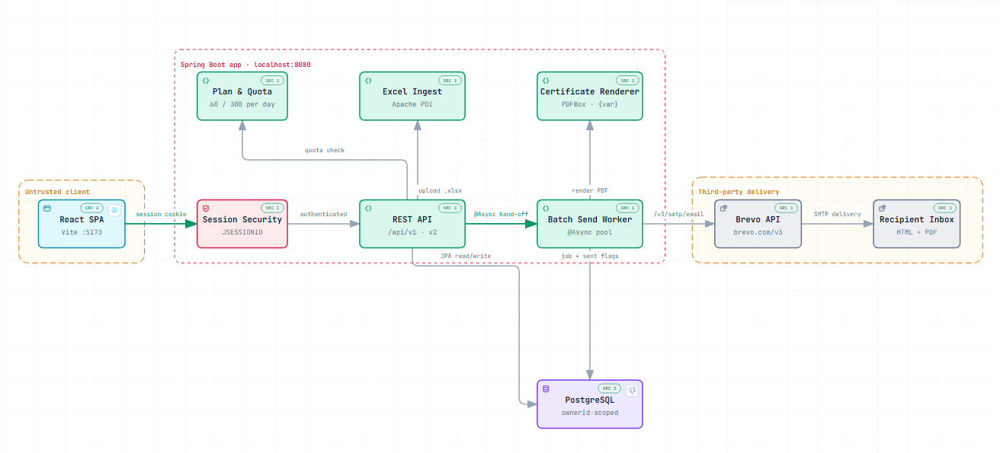

  
  <h1>distribute</h1>

Personalized PDF certificates, generated from one template and one Excel roster, then emailed to every recipient in a batch. Use it for course completions, workshop attendance letters, internship certificates, event awards, and training programs - anywhere you currently hand the same certificate out one person at a time.

## Features

- Certificate editor with live preview, reusable templates
- Excel/CSV roster upload with preview, validation, and batching
- Per-recipient merge fields (name, course, date, ID) rendered into each PDF
- One-click batch send over a global Brevo account, PDF attached
- Send status and per-batch delivery tracking
- Plans, usage limits, and admin user management
- Session auth (BCrypt), email verification, and password reset

## Architecture

**[distribute](https://distribute.das-folio.in/architecture)** - open the interactive runtime walkthrough (click any node to trace the request).

## Tech stack

| Layer | Tech |
|-------|------|
| Backend | Spring Boot 3.3, Java 17, Hibernate |
| Frontend | React 18, Vite 5, Tailwind CSS 3 |
| Database | PostgreSQL 18 |
| Auth | Session-based (JSESSIONID) + BCrypt |
| Email | Brevo transactional API |

